## 聊一聊CSS In JS 的几种方式和设置项目主题等基操,实操
> 将css样式写在单独的css样式文件(.css, .less, .scss之类)的文件中,一直是前端开发的约定成俗. 而 CSS In JS就是将应用的CSS样式写在JavaScript文件中,从而使得CSS拥有JS(也同样满足一定程度React的All in JS)的特性，列如模块声明，变量定义，函数调用，条件判断等。

> CSS In JS是一种技术，而非某一个库的实现，我们可以手写代码来实现这种技术，也可以借助现有工具库来实现该技术。


__本文将从迄今主要CSS In JS库主流的三个库进行介绍__

1. [styled-components](https://styled-components.com/)   33.4k star __主要__
2. [radium](https://formidable.com/open-source/radium/)  7.4k star
3. [linaria](https://github.com/callstack/linaria)       7.1k star  __针对Taro3.x__(0运行时)

#### 一、styled-components 
* styled-components会生成带有类的实际样式表，并通过className属性将这些类附加到样式化组件的DOM节点上。在运行时，它将生成的样式表注入文档标题的末尾。

##### 1. 安装
* shell
```shell
npm install --save styled-components
# 建议使用npm 如果使用yarn，请参看官方文档
```
* cdn
```javaScript
<script src="https://unpkg.com/styled-components/dist/styled-components.min.js"></script>
```
##### 2.  插件库
* vscode: vscode-styled-components
* webstorm: Styled Components

##### 3. 基础使用语法介绍

* 3.1 hellowWorld
```react
import styled, { css }  from 'styled-components'

// @1hello world
const Title = styled.h1`
  font-size: 1.5rem;
  text-align: center;
  color: palevioletred;
`;
const Wrapper = styled.section`
  padding: 4em;
  background: papayawhip;
`;
<Wrapper>
  <Title>
    Hello World!
  </Title>
</Wrapper>
```
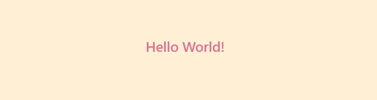

* 3.2 props 传递 && extend Styles

```react

const Button = styled.button`
  background: ${props => props.primary ? "palevioletred" : "white"};
  color: ${props => props.primary ? "white" : "palevioletred"};
  font-size: 1em;
  margin: 1em;
  padding: 0.25em 1em;
  border: 2px solid palevioletred;
  border-radius: 3px;
`;

const TomatoButton = styled(Button)`
  color: tomato;
  border-color: tomato;
`;

<Button>Normal</Button>
<Button primary>Primary</Button>
<TomatoButton>Tomato Button</TomatoButton>
```
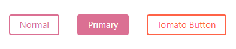

* 3.3 与自定义组件配合
```react
const ReversedButton = props => (
  <Button {...props} children={props.children.split('').reverse()}/>
)
<ReversedButton>这是一个按钮</ReversedButton>
```
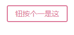
* 3.4 Styling any component 可以给你当前传递任何自定义标签 定义样式
```react
import { Link } from 'react-router-dom'
const StyleLink = styled(Link)`
  color: palegoldenrod;
  font-weight: bold;
`;
<StyleLink>this is a styleLink</StyleLink>
```
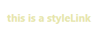

* 3.5 styled会足够聪明分辨出传递的属性
```react
// 可以自动为您过滤非标准属性 
// 这种方式意味着我们不需要在组件中使用props 的条件来渲染类名,可以减少组件中的混乱情况
// 并且使得CSS 和 JavaScript之间的关注点分离
const Input = styled.input`
  padding: 0.5em;
  margin: 0.5em;
  color: ${props => props.inputColor || "palevioletred"};
  background: papayawhip;
  border: none;
  border-radius: 3px;
  font-size: 18px;
`;
<Input defaultValue="@probablyup" type="text" />
<Input defaultValue="@geelen" type="text" inputColor="rebeccapurple" />
```
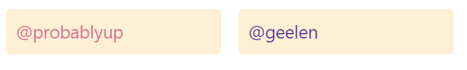
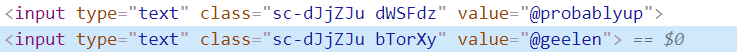

* 3.6 利用& 符号有时候会比CSS更加强大
```react
const Thing = styled.div.attrs((/* props */) => ({ tabIndex: 0 }))`
  color: blue;

  &:hover {
    color: red; // <Thing> when hovered
  }

  & ~ & {
    background: tomato; // <Thing> as a sibling of <Thing>, but maybe not directly next to it
  }

  & + & {
    background: red; // <Thing> next to <Thing>
  }

  &.something {
    background: orange; // <Thing> tagged with an additional CSS class ".something"
  }

  .something-else & {
    border: 1px solid; // <Thing> inside another element labeled ".something-else"
  }
`;

<Thing>Hello world!</Thing>
<Thing>How ya doing?</Thing>
<Thing className="something">The sun is shining...</Thing>
<div>Pretty nice day today.</div>
<Thing>Don't you think?</Thing>
<div className="something-else">
  <Thing>Splendid.</Thing>
</div>
```
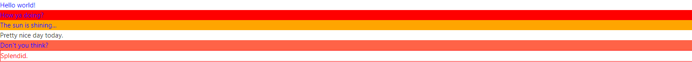

* 3.7 && 符号可以增加组件上规则的特殊性, 等于渲染两个类增加权重
```react
const Thing2 = styled.div`
  && {
    color: blue;
  }
`
<Thing2>
  I'm blue, balabalabalabala
</Thing2>
```
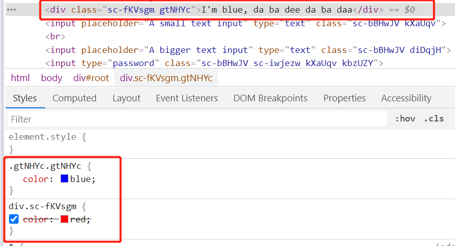

* 3.8 避免传入的参数过于复杂,或者单一化,提供了一个attrs参数 并且允许attrs样式进行重写
```react

const AttInput = styled.input.attrs(props => ({
  type: "text",
  size: props.size || "1em"
}))`
  color: palegoldenrod;
  font-size: 1em;
  border: 2px solid palevioletred;
  border-radius: 3px;
  // 可以使用传入的参数进行一定的计算
  margin: ${props => props.size};
  padding: ${props => props.size};
`
//  允许attrs 里面的样式重写
const PasswordInput = styled(AttInput).attrs({
  type: "password",
})`
  border: 2px solid aqua;
`;
<AttInput placeholder="A small text input" />
<br />
<AttInput placeholder="A bigger text input" size="2em" />
<PasswordInput />

```
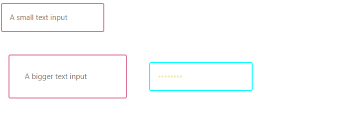

* 3.9 动画Animations
```
const rotate = keyframes`
  from {
    transform: rotate(0deg);
  }

  to {
    transform: rotate(360deg);
  }
`;
const Rotate = styled.div`
  display: inline-block;
  animation: ${rotate} 2s linear infinite;
  padding: 2rem 1rem;
  font-size: 1.2rem;
`;
<Rotate>&lt; 💅🏾 &gt;</Rotate>
```
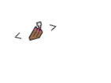

* 3.10 refs
```react
// @10 Refs
const Input = styled.input`
  padding: 0.5em;
  margin: 0.5em;
  color: palevioletred;
  background: papayawhip;
  border: none;
  border-radius: 3px;
`;
<Input
  ref={inputRef}
  placeholder="悬浮聚焦!"
  onMouseEnter={() => {
    inputRef.current.focus()
  }}
/>
```

* 3.11 权重
```
// 带样式的组件类优先于全局类，因为默认情况下，带样式的组件会在运行时在<head>末尾注入其样式。因此，它的样式胜过其他单个类名选择器。
// 一种解决方案是提高样式表中选择器的特异性：
// 意思就是使用styled-components 的权限要高于className 的权限,所以这里需要使用id 或者更高权重,important
const MyComponent = styled.div`background-color: green;`;
<MyComponent className="red-bg" >12123</MyComponent>
```
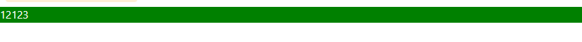

* 3.12 插值标记
```
// 有时候处理器会引发错误(列如e.g. CssSyntaxError),即使我们的语法没有错误，这通常是由于插值造成的，更具体地说是处理器不知道您要插值的事实。
// 所以要告诉他
const something = 'background'
const Button = styled.div`
  // Tell the processor that "something" is a property
  ${/* sc-prop */ something}: papayawhip;

// sc-block
// sc-selector
// sc-declaration
// sc-property
// sc-value
```

* 3.13 主题化思路API createGlobalStyle withTheme ThemeProvider和库styled-theming
__ThemeProvider__
>用于主题化的辅助组件。通过上下文API将主题注入到组件树中位于其下方任何位置的所有样式化组件中。检查有关主题的部分。
```
const Box = styled.div`
  color: ${props => props.theme.color};
`
<ThemeProvider theme={{ color: 'mediumseagreen' }}>
  <Box>I'm mediumseagreen!</Box>
</ThemeProvider>
```

__createGlobalStyle__
> 辅助函数，用于生成处理全局样式的特殊StyledComponent。通常，样式化的组件会自动限定于本地CSS类的范围，因此会与其他组件隔离。在createGlobalStyle的情况下，将消除此限制，并且可以应用CSS重置或基本样式表之类的东西。 可以理解成一种可动态化编译的reset.css

```react
import { createGlobalStyle } from 'styled-components'

const GlobalStyle = createGlobalStyle`
  body {
    color: ${props => (props.whiteColor ? 'white' : 'black')};
  }
`
<React.Fragment>
  <GlobalStyle whiteColor />
  <Navigation /> {/* 一般放在最高等级 */}
</React.Fragment>
```
因为GlobalStyle组件是StyledComponent，这意味着它也可以从<ThemeProvider>组件（如果提供）访问主题。 __因此我们可以利用theme 和 GlobalStyle定制化，每个页面的不同主题思路__  
```
const GlobalStyle = createGlobalStyle`
  body {
    color: ${props => (props.whiteColor ? 'white' : 'black')};
    font-family: ${props => props.theme.fontFamily};
  }
`
```

__withTheme__
> 这是一个高阶组件工厂，用于从ThemeProvider获取当前主题并将其作为主题道具传递给您的组件。__通过该工厂函数，可以在compontents中定义动态化配置的组件， 更好的定义react的模块化__
```
// demo未测试,原官网未react class形式
import { withTheme } from 'styled-components'
const MyComponent = (props)=> {
  console.log(props.theme)
  return <>.....</>
}
export default withTheme(MyComponent)
```

__styled-theming__
> 一个配合styled-components 主题化思路的库,__实质就是一个封装返回styled-components的函数__
```react
import React from 'react'
import styled, { ThemeProvider } from 'styled-components'
import theme from 'styled-theming'
const boxBackgroundColor = theme('mode', {
  light: '#fff',
  dark: '#000',
})
const Box = styled.div`
  background-color: ${boxBackgroundColor};
`
export default function App() {
  return (
    <ThemeProvider theme={{ mode: 'light' }}>
      <Box>Hello World</Box>
    </ThemeProvider>
  )
}
```

#### 二、styled-components + antd 自定义主题样式
> antd有自带的修改主题方案,这一点可以参考[官方文档](https://ant.design/docs/react/customize-theme-cn), 这里提供一种方法,可以单独修改自己想要修改的特定组件,并且按照styled-components主题做出对应的显示
* antdTheme.js
```react
import styled, { css } from 'styled-components';  
import theme from 'styled-theming';
import { Button as AButton } from '../../node_modules/antd'
import React from 'react'

// 修改框架的样式, 以修改 antd 框架Button样式为例子
const buttonTheme = theme('buttonMode', {
  light: css`
    background: #ffffff;
    color: #000;
  `,
  dark: css`
    background: #000;
    color: #ffffff;
  `
})

const Button = styled((props)=><AButton {...props}/>)`
  ${buttonTheme}
`

// 导出所有antd组件
export * from '../../node_modules/antd'

// 导出特定的修改组件
export { Button, buttonTheme }
```

*通过react-app-rewired + config-overrides.js 配置别名达到修改引入antd的方式
```javaScript
const { useBabelRc, override, addWebpackAlias } = require('customize-cra')
const path = require('path')
module.exports = override(
  useBabelRc(),
  addWebpackAlias({
    ['antd']: path.resolve(__dirname, './src/Theme/antdTheme.js')
  })
)
```

* 组件页面
```react
import { ThemeProvider } from 'styled-components'
import { Button } from 'antd'
import TestTheme1 from './child/TestTheme1' // 子antd button 组件

function StyleTheme1(params) {
  return <ThemeProvider theme={{ buttonMode: 'dark' }}>
    <Button type="ghost">父按钮</Button>
    <TestTheme1 />
  </ThemeProvider>
}
```
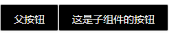

#### 三、styled-components配置全局主题&根据环境变量运行和打包不同主题

* 通过cross-env 配置环境变量
```shell
"dev:dark": "cross-env REACT_APP_THEME=dark react-app-rewired start",
"build:dark": "cross-env REACT_APP_THEME=dark react-app-rewired build"
```

* themes.js
```react
import styled, { css } from 'styled-components';  
import theme from 'styled-theming';

// 修改默认样式，或者设置一些公共的样式
const buttonTheme = theme('buttonMode', {
  light: css`
    background: #ffffff;
    color: #000;
  `,
  dark: css`
    background: #000;
    color: #ffffff;
  `
})

const Button = styled.button`
  ${buttonTheme}
`

export { Button }
```

* 页面组件
```react
import React from 'react'
import { Button } from '../Theme/themes' 
import TestTheme2 from './child/TestTheme2.js'
import { ThemeProvider } from 'styled-components'

// 使用npm run dev:dark 生成黑色按钮
function StyleTheme2() {
  return (
    <ThemeProvider theme={{ buttonMode: process.env.REACT_APP_THEME }}>
      <Button type="ghost">父按钮</Button>
      <br/>
      <br/>
      <TestTheme2 />
    </ThemeProvider>
    )
}
export default StyleTheme2
```
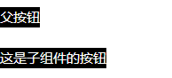


#### 四、Vue使用styled-components的方式
> 关于Vue使用styled-components的方式这里不做阐述, 正常情况下Vue是不需要使用Css in Js 技术的,因为Vue组件和样式是可以不分离的写在同一Vue文件中,并且slot和插值表达式等已经做了较为完美的处理和方案,
但是在特定情况下,也可以有选择需要使用的场景. 具体可以参考[教你在Vue项目中使用React超火的CSS-in-JS库: styled-components](https://segmentfault.com/a/1190000021388921?utm_source=tag-newest), [vue-styled-components](https://github.com/styled-components/vue-styled-components)
#### 五、radium
>Radium is a set of tools to manage inline styles on React elements. It gives you powerful styling capabilities without CSS. 
翻译：Radium是一组用于管理React元素上的内联样式的工具。它为您提供了强大的样式功能，而无需CSS.

* 安装
```shell
npm i radium
```

* radium基础使用
```react
import Radium from 'radium'
import React from 'react'

const styles = {
  base: {
    color: '#fff',
    ':hover': {
      background: '#0074D9'
    }
  },

  primary: {
    background: '#0074D9'
  },

  warning: {
    background: '#FF4136'
  }
};

function Button(props) {
  return (
    <>
      <button style={[styles.base, styles[props.kind]]}>
        {props.children}
      </button>
    </>
  );
}

Button = Radium(Button)

export default () => <div><Button kind="warning">primary button</Button></div>
```
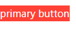
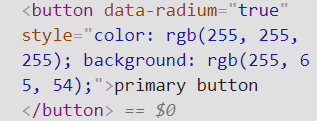

__因其内联样式的形式，CSS层级级别较高，所以非从零开始的项目不建议中途加入使用（仅个人看法）。__

#### 六、linaria
* 安装和使用
```shell
npm install linaria @linaria/core @linaria/react @linaria/babel-preset @linaria/shaker
```
* 通过react-app-rewired + config-overrides.js 对create-react-app 加入@linaria/webpack-loader
```js
const { useBabelRc, override, addWebpackModuleRule } = require('customize-cra')

const path = require('path')

module.exports = override(
  useBabelRc(),
  addWebpackModuleRule({
    test: /\.(js|tsx)$/,
    exclude: /node_modules/,
    use: [
      { loader: 'babel-loader' },
      {
        loader: '@linaria/webpack-loader',
        options: {
          cacheDirectory: 'src/.linaria_cache',
          sourceMap: process.env.NODE_ENV !== 'production',
        },
      },
    ],
  }),
)
```

* 一些不同于styled-components 的API
1. css标记允许您创建简单的类名称：
```react
import { css } from '@linaria/core';

// Create a class name
const title = css`
  font-size: 24px;
  font-weight: bold;
`;

function Heading() {
  // Pass it to a component
  return <h1 className={title}>This is a title</h1>;
}
```
2. ...

#### 七、linaria 主题化的几个方案
##### 1. CSS 自定义属性 （某些浏览器 并不支持css自定义属性，列如IE11）
```
// 创建不同主题的名称
const a = css`
  --color-primary: #6200ee;
  --color-accent: #03dac4;
`;

const b = css`
  --color-primary: #03a9f4;
  --color-accent: #e91e63;
`;

// 将主题应用于根元素
<Container className={a} />; 

// 可以在任何子元素中使用这些变量
const Button = styled.button`
  background-color: var(--color-accent);
`;
```

##### 2. Class names
> 在根元素中添加代表主题的类名（例如 theme-dark），并利用CSS子选择器基于此父类名对元素进行主题化

* linariaTheme.js
```react
import { styled } from '@linaria/react';

const colors = {
  light: {
    text: 'black',
  },
  dark: {
    text: 'white',
  },
  green:{
    text: 'green'
  }
};

export const theming = cb =>
  Object.keys(colors).reduce((acc, name) => Object.assign(acc, {
    [`.theme-${name} &`]: cb(colors[name]),
  }), {});

// Use the helper in your styles
export const Header = styled.h1`
  text-transform: uppercase;

  ${theming(c => ({
    color: c.text,
  }))};
`;
```
* 组件页面
```
import React from 'react'
import { Header } from '../../Theme/linariaTheme'

function LinariaTheme1() {
  return <div className='theme-green'>
    <Header>abcdefghi</Header> 
  </div>
}

export default LinariaTheme1
```
##### 3. React Context
> 使用React Context传递颜色，然后使用带有样式标签的函数插值来使用颜色,一般使用[react-theme-provider](https://github.com/callstack/react-theme-provider)库来配合实现,  这一点与styled-components中ThemeProvider 及其类似，具体可参考 [react-theme-provider](https://github.com/callstack/react-theme-provider)


##### 八、配合storybook
1. styled-components
* 全局GlobalStyles  .storybook/preview.js
```react
import GlobalStyles from '../src/styles/global'; // 设置的全局代码

export const decorators = [
  (Story) => (
    <>
      <GlobalStyles />
      <Story />
    </>
  )
]
```
* 单个组件设置主题可以参考 上面的 __styled-components + antd 自定义主题样式__
* 因为其是运行时的方式,所以不建议在每个组件中增加主题,可以在总文件中增加,根据传入参数配置主题

2. linaria
* [Taro加入linaria](http://taro-docs.jd.com/taro/docs/css-in-js) 建议使用linaria
* storybook 加入linaria

#### 八、优缺点(以下大部分内容选自官网翻译)
##### styled-components
* 优
1. 自动跟踪呈现: styled-components可以完全自动跟踪在页面上呈现了哪些组件，并注入其样式，而不会注入其他任何东西。结合代码拆分，这意味着您的用户可以加载最少数量的必需代码。
2. 没有类名错误：styled-components会为您的样式生成唯一的类名。您无需担心重复，重叠或拼写错误。
3. 可以轻松管理增减CSS： 样式和组件写在一起，组件未使用样式就会被自动打包时候删除
4. 简单的动态样式：基于组件的道具或全局主题调整样式是简单直观的，而无需手动管理数十个类。
5. 无痛的维护：您不必寻找不同的文件来查找影响您组件的样式，因此无论您的代码库有多大，维护都是小菜一碟。
6. 供应商自动前缀：将CSS编写为当前标准，然后让样式化的组件处理其余部分。

* 缺
1. 增加组件复杂性，每个组件的代码量，并且样式不分离组件看起来不纯净
2. 增加约128k打包体积，若要考虑首屏渲染？
3. 学习适应成本


##### radium
* 优
1. ....

* 缺
1. ....


##### linaria
* 优
1. 生成唯一选择器，大型项目中无需考虑选择器重名的问题
2. 样式与组件可以位于同一文件中，也可以抽离
3. 增删代码更易，不需要担心破坏组件，或者删除多余样式，没有删除不需要的样式
4. 无需预处理器
5. 自动删除未使用的样式
6. 自动供应商前缀，也仍然可以使用PostCSS之类的工具来进一步优化CSS。
7. 0运行时，在运行代码的时候已经编译好了CSS，所以不会增加包的体积
8. 较为友好的支持ssr, 加速首屏渲染 的时间

* 缺
1. Linaria 是基于 CSS 变量的，大部分现代浏览器支持这个特性，但是对于 IE 11 以及以下，是不支持的，所以如果你需要支持 IE 11 ，也许 Linaria 不是你最好的选择


#### 文中代码github地址,如有帮助,请star
[CssInJss](https://github.com/bigfairy-Jing/CssInJS)

#### 参考连接
* [styled-components](https://styled-components.com/)
* [radium](https://formidable.com/open-source/radium/)
* [linaria github地址](https://github.com/callstack/linaria)
* [CSS in JS的好与坏](https://zhuanlan.zhihu.com/p/103522819)
* [Taro 文档中CSS-in-JS部分](http://taro-docs.jd.com/taro/docs/css-in-js)
* [教你在Vue项目中使用React超火的CSS-in-JS库: styled-components](https://segmentfault.com/a/1190000021388921?utm_source=tag-newest)
* [编译型 JSS 框架 Linaria 的原理](https://juejin.cn/post/6897763694491631624)
* [styled-components 运行原理](https://juejin.cn/post/6844904196425121800)